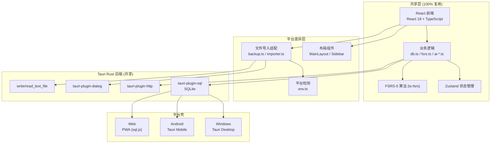
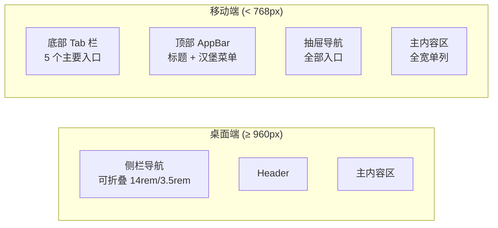

# Reciter → Android 移动端迁移方案

> **项目**: Reciter v0.16.2 · 本地优先英语学习与记忆客户端
> **目标**: 将现有 Tauri 2 桌面 + PWA 工程迁移到 Android 原生应用
> **日期**: 2026-09-04

---

## 一、项目现状分析

### 1.1 技术架构总览

| 层 | 现有技术 | Android 可用性 |
|---|---|---|
| 桌面壳 | **Tauri 2** (Rust) | ✅ Tauri 2 原生支持 Android |
| 前端 | **React 18** + **TypeScript** + **Vite 7** | ✅ WebView 中直接运行 |
| UI | **Tailwind CSS v4** + **shadcn/ui** | ⚠️ 需适配移动端布局 |
| 状态/路由 | **Zustand 5** + **React Router 7** (HashRouter) | ✅ 完全兼容 |
| 记忆算法 | **FSRS-5** (ts-fsrs) | ✅ 纯 JS，零依赖 |
| 数据库 | SQLite (Tauri) / sql.js WASM (Web) | ✅ tauri-plugin-sql 支持 Android |
| 图表 | Recharts | ✅ SVG 渲染，WebView 兼容 |
| PWA | vite-plugin-pwa | ❌ Android 原生不需要 |
| 云同步 | Cloudflare Worker | ✅ HTTP 接口，无平台限制 |

### 1.2 关键依赖的 Android 兼容性

| 依赖 | 用途 | Android 兼容 | 备注 |
|---|---|---|---|
| `@tauri-apps/api` | Tauri IPC | ✅ | Tauri 2 已支持移动端 |
| `@tauri-apps/plugin-sql` | SQLite | ✅ | [已支持 Android/iOS](https://github.com/niclas-niclas/tauri-plugin-sql/tree/v2) |
| `@tauri-apps/plugin-http` | HTTP 请求 | ✅ | 已支持移动端 |
| `@tauri-apps/plugin-dialog` | 文件选择对话框 | ⚠️ | 支持 Android，但 API 行为与桌面不同 |
| `sql.js` / `idb-keyval` | Web 后端 WASM | ❌ 不需要 | Android 走 Tauri 后端 |
| `react-markdown` | Markdown 渲染 | ✅ | 纯 JS |
| `recharts` | 图表 | ✅ | SVG 渲染 |
| `ts-fsrs` | FSRS-5 算法 | ✅ | 纯 JS |
| `lucide-react` | 图标 | ✅ | SVG 图标 |

### 1.3 Rust 后端分析 — [lib.rs](src-tauri/src/lib.rs)

```rust
#[cfg_attr(mobile, tauri::mobile_entry_point)]  // ← 已预留移动端入口
pub fn run() { ... }
```

> [!TIP]
> Rust 后端代码已使用 `#[cfg_attr(mobile, tauri::mobile_entry_point)]` 宏，说明项目创建时就考虑了移动端。这大大降低了迁移难度。

Rust 侧功能非常轻量（"薄壳"）：
- `tauri-plugin-sql` → SQLite 数据库 + 迁移
- `tauri-plugin-http` → HTTP 请求
- `tauri-plugin-dialog` → 文件选择
- `write_text_file` / `read_text_file` → JSON 导出/恢复

### 1.4 数据库抽象层 — [sql/backend.ts](src/lib/sql/backend.ts)

项目已实现 **双后端 SQL 抽象**：
- [TauriBackend](src/lib/sql/tauri-backend.ts) → 桌面 (tauri-plugin-sql)
- [SqlJsBackend](src/lib/sql/sqljs-backend.ts) → Web (sql.js WASM + IndexedDB)

Android 直接使用 `TauriBackend`，无需新增后端。

### 1.5 平台检测 — [env.ts](src/lib/env.ts)

```typescript
export function isTauri(): boolean {
  return typeof window !== "undefined" && "__TAURI_INTERNALS__" in window;
}
```

Android Tauri 应用中 `isTauri()` 返回 `true`，所有桌面端代码路径自动生效。

---

## 二、可行性评估

### 2.1 总体结论

> [!IMPORTANT]
> **可行性评级：★★★★☆（高度可行）**
>
> Reciter 的架构天然适合迁移到 Android：
> - Tauri 2 已原生支持 Android，Rust 后端已预留移动端入口
> - 前端是标准 React SPA，在 WebView 中直接运行
> - 数据库抽象层已做好双后端，Android 直接复用 `TauriBackend`
> - 唯一的大工作量在 **UI 布局适配**（侧栏→底栏/抽屉）和 **平台 API 差异处理**

### 2.2 风险矩阵

| 风险点 | 影响 | 难度 | 对策 |
|---|---|---|---|
| 侧栏导航在小屏不可用 | 🔴 高 | 中 | 改为底部 Tab + 抽屉导航 |
| 桌面端 Dialog API 差异 | 🟡 中 | 低 | tauri-plugin-dialog 已适配 Android，需微调 |
| 文件导入（Markdown/CSV） | 🟡 中 | 中 | Android 使用 Content URI → 需适配文件读取 |
| 页面内容在 375px 宽度溢出 | 🟡 中 | 中 | Tailwind 响应式断点逐页适配 |
| TTS 发音 | 🟢 低 | 低 | Android WebView 支持 Web Speech API |
| Recharts 图表触控 | 🟢 低 | 低 | Recharts 原生支持触控 |
| 键盘快捷键 | 🟢 低 | 低 | 移动端不需要，可按平台隐藏 |
| Settings 页面过长 | 🟡 中 | 低 | 改为分区折叠/Tab 布局 |
| WebView 性能 | 🟢 低 | 低 | Android System WebView 性能优良 |
| 构建工具链（NDK 等） | 🟢 低 | 低 | Tauri CLI 自动管理 |

---

## 三、推荐迁移方案：Tauri 2 Mobile

### 为什么不选 Capacitor / React Native？

| 方案 | 优势 | 劣势 |
|---|---|---|
| **Tauri 2 Mobile** ✅ | 零迁移成本、共用 Rust 后端、共享同一套前端代码 | Android WebView 性能略逊原生 |
| Capacitor | 成熟的移动端生态 | 需重写 Rust 后端逻辑、数据库迁移重做 |
| React Native | 原生组件性能好 | 需完全重写 UI 层、不兼容 Tailwind/shadcn |

> **结论**：Tauri 2 Mobile 是唯一能在最小改动量下完成迁移的方案。

---

## 四、迁移架构设计

### 4.1 目标架构



### 4.2 布局适配策略



**底部 Tab 映射**（5 个主要入口）：

| Tab | 图标 | 对应页面 |
|---|---|---|
| 今日 | `LayoutDashboard` | Dashboard |
| 词库 | `BookOpen` | DeckList |
| 学习 | `GraduationCap` | Study |
| 每日一文 | `Newspaper` | DailyArticle |
| 更多 | `Menu` | → 抽屉菜单（导入/统计/弱词本/设置） |

### 4.3 平台检测增强

现有 [env.ts](src/lib/env.ts) 需增加移动端检测：

```typescript
// 新增
export function isMobile(): boolean {
  return isTauri() && (
    navigator.userAgent.includes("Android") ||
    navigator.userAgent.includes("iPhone")
  );
}

export function isAndroid(): boolean {
  return isTauri() && navigator.userAgent.includes("Android");
}

export function isDesktop(): boolean {
  return isTauri() && !isMobile();
}
```

---

## 五、具体实施步骤（供编码智能体参考）

### Phase M1：工程搭建 · Android 项目初始化

**目标**：让现有代码在 Android 模拟器/设备上成功运行

#### 步骤 M1.1：安装 Android 开发环境

```bash
# 1. 安装 Android Studio（提供 SDK、NDK、模拟器）
# 2. 安装 Rust Android targets
rustup target add aarch64-linux-android armv7-linux-androideabi x86_64-linux-android i686-linux-android

# 3. 设置环境变量（或在 Android Studio SDK Manager 中确认路径）
# ANDROID_HOME = C:\Users\<user>\AppData\Local\Android\Sdk
# NDK_HOME = $ANDROID_HOME/ndk/<version>
# JAVA_HOME = Android Studio 内置 JDK
```

#### 步骤 M1.2：初始化 Tauri Android 项目

```bash
cd <项目根目录>
npm run tauri android init
```

这会在 `src-tauri/gen/android/` 下生成 Android 项目结构：
```
src-tauri/gen/android/
├── app/
│   ├── src/main/
│   │   ├── java/com/reciter/app/MainActivity.kt
│   │   ├── AndroidManifest.xml
│   │   └── res/
│   └── build.gradle.kts
├── build.gradle.kts
├── gradle/
└── settings.gradle.kts
```

#### 步骤 M1.3：配置 Cargo.toml Android targets

修改 [Cargo.toml](src-tauri/Cargo.toml)：

```toml
[lib]
name = "reciter_lib"
crate-type = ["staticlib", "cdylib", "rlib"]
# "cdylib" 已存在 → Android JNI 需要 cdylib，无需额外改动
```

> [!NOTE]
> 现有 `Cargo.toml` 已包含 `cdylib`，Android 构建所需的 crate 类型已就位。

#### 步骤 M1.4：验证 tauri-plugin-sql Android 支持

确认 `Cargo.toml` 中 `tauri-plugin-sql` 的 `sqlite` feature 已启用（已满足）。在 Android 上，该插件使用 `rusqlite` 编译到本地 SQLite，而非依赖系统库。

#### 步骤 M1.5：首次构建与运行

```bash
# 开发模式（连接 USB 设备或运行模拟器）
npm run tauri android dev

# 生产构建（APK/AAB）
npm run tauri android build
```

#### 步骤 M1.6：验证核心功能链路

在 Android 上验证：
- [ ] 应用启动、数据库初始化
- [ ] 词库列表加载
- [ ] 新增/编辑/删除卡片
- [ ] FSRS 学习流程
- [ ] AI API 调用（HTTP 请求）
- [ ] 云同步上传/下载

> [!WARNING]
> 如果 `write_text_file` / `read_text_file` Rust 命令在 Android 上因文件路径问题失败，需使用 Tauri 的 `app_data_dir()` API 获取 Android 应用数据目录。

---

### Phase M2：平台检测与环境适配

**目标**：前端能区分桌面/移动端，按平台执行不同逻辑

#### 步骤 M2.1：增强 env.ts

修改 [src/lib/env.ts](src/lib/env.ts)：

```typescript
/** 运行环境检测 */
export function isTauri(): boolean {
  return typeof window !== "undefined" && "__TAURI_INTERNALS__" in window;
}

export function isWeb(): boolean {
  return !isTauri();
}

/** 移动端（Android / iOS）检测 */
export function isMobile(): boolean {
  if (!isTauri()) return false;
  const ua = navigator.userAgent.toLowerCase();
  return ua.includes("android") || ua.includes("iphone") || ua.includes("ipad");
}

export function isAndroid(): boolean {
  return isTauri() && navigator.userAgent.toLowerCase().includes("android");
}

export function isDesktop(): boolean {
  return isTauri() && !isMobile();
}
```

#### 步骤 M2.2：创建 useIsMobile Hook

新建 `src/hooks/useIsMobile.ts`：

```typescript
import { useState, useEffect } from "react";
import { isMobile } from "@/lib/env";

/** 响应式移动端检测：同时考虑 Tauri 平台 + 视口宽度 */
export function useIsMobile(breakpoint = 768): boolean {
  const [mobile, setMobile] = useState(() => {
    if (isMobile()) return true;
    return typeof window !== "undefined" && window.innerWidth < breakpoint;
  });

  useEffect(() => {
    if (isMobile()) return; // Tauri 移动端始终为 true
    const mq = window.matchMedia(`(max-width: ${breakpoint - 1}px)`);
    const handler = (e: MediaQueryListEvent) => setMobile(e.matches);
    mq.addEventListener("change", handler);
    return () => mq.removeEventListener("change", handler);
  }, [breakpoint]);

  return mobile;
}
```

#### 步骤 M2.3：适配文件路径

修改 [backup.ts](src/lib/backup.ts) 和 Rust 命令中的文件操作：

```typescript
import { appDataDir } from "@tauri-apps/api/path";
import { isAndroid } from "@/lib/env";

// 在 Android 上使用应用私有目录
async function getBackupDir(): Promise<string> {
  if (isAndroid()) {
    return await appDataDir();
  }
  return ""; // 桌面端使用对话框选择路径
}
```

---

### Phase M3：布局响应式改造

**目标**：核心布局组件适配移动端小屏幕

> [!IMPORTANT]
> 这是工作量最大的阶段，需要逐个组件调整。

#### 步骤 M3.1：改造 MainLayout（侧栏 → 底栏 + 抽屉）

修改 [MainLayout.tsx](src/components/layout/MainLayout.tsx)：

```tsx
import { useState } from "react";
import { Outlet, useLocation } from "react-router-dom";
import Sidebar from "./Sidebar";
import BottomTabBar from "./BottomTabBar";       // 新增
import MobileDrawer from "./MobileDrawer";       // 新增
import Header from "./Header";
import MobileHeader from "./MobileHeader";       // 新增
import { useDbStore } from "@/stores/useDbStore";
import { useIsMobile } from "@/hooks/useIsMobile";

export default function MainLayout() {
  const location = useLocation();
  const dbError = useDbStore((s) => s.error);
  const mobile = useIsMobile();
  const [collapsed, setCollapsed] = useState(
    () => localStorage.getItem("reciter-sidebar-collapsed") === "1"
  );
  const [drawerOpen, setDrawerOpen] = useState(false);

  if (mobile) {
    return (
      <div className="flex h-screen w-full flex-col overflow-hidden bg-background text-foreground">
        <MobileHeader onMenuClick={() => setDrawerOpen(true)} />
        <MobileDrawer open={drawerOpen} onClose={() => setDrawerOpen(false)} />
        {dbError && (
          <div className="border-b border-destructive/30 bg-destructive/10 px-4 py-1.5 text-xs text-destructive">
            数据库不可用：{dbError}
          </div>
        )}
        <main key={location.pathname} className="flex-1 overflow-y-auto p-4">
          <Outlet />
        </main>
        <BottomTabBar />
      </div>
    );
  }

  // 桌面端保持不变...
  return (/* 现有桌面布局 */);
}
```

#### 步骤 M3.2：新建 BottomTabBar 组件

新建 `src/components/layout/BottomTabBar.tsx`：

```tsx
import { NavLink } from "react-router-dom";
import {
  BookOpen,
  GraduationCap,
  LayoutDashboard,
  Menu,
  Newspaper,
} from "lucide-react";
import { cn } from "@/lib/utils";

const TABS = [
  { to: "/", label: "今日", icon: LayoutDashboard },
  { to: "/decks", label: "词库", icon: BookOpen },
  { to: "/study", label: "学习", icon: GraduationCap },
  { to: "/daily-article", label: "一文", icon: Newspaper },
];

export default function BottomTabBar() {
  return (
    <nav className="flex shrink-0 border-t border-border bg-background safe-area-bottom">
      {TABS.map((tab) => (
        <NavLink
          key={tab.to}
          to={tab.to}
          end={tab.to === "/"}
          className={({ isActive }) =>
            cn(
              "flex flex-1 flex-col items-center gap-0.5 py-2 text-[10px] transition-colors",
              isActive ? "text-primary" : "text-muted-foreground"
            )
          }
        >
          <tab.icon className="size-5" />
          <span>{tab.label}</span>
        </NavLink>
      ))}
    </nav>
  );
}
```

> 注意 `safe-area-bottom` 类用于适配 Android 手势导航栏的安全区域。

#### 步骤 M3.3：新建 MobileHeader 组件

新建 `src/components/layout/MobileHeader.tsx`：

```tsx
import { useLocation } from "react-router-dom";
import { Menu } from "lucide-react";
import { Button } from "@/components/ui/button";

const TITLE_MAP: Record<string, string> = {
  "/": "今日学习",
  "/decks": "词库",
  "/study": "学习",
  "/import": "导入",
  "/stats": "统计",
  "/weak-words": "弱词本",
  "/daily-article": "每日一文",
  "/settings": "设置",
};

export default function MobileHeader({ onMenuClick }: { onMenuClick: () => void }) {
  const { pathname } = useLocation();
  const title = TITLE_MAP[pathname] ?? "Reciter";

  return (
    <header className="flex h-12 shrink-0 items-center gap-3 border-b border-border bg-background px-4">
      <Button variant="ghost" size="icon" onClick={onMenuClick}>
        <Menu className="size-5" />
      </Button>
      <h1 className="text-base font-semibold">{title}</h1>
    </header>
  );
}
```

#### 步骤 M3.4：新建 MobileDrawer 抽屉导航

新建 `src/components/layout/MobileDrawer.tsx`：

```tsx
import { NavLink } from "react-router-dom";
import {
  AlertTriangle, BarChart3, BookOpen, FileUp,
  GraduationCap, LayoutDashboard, Newspaper, Settings, X,
} from "lucide-react";
import { cn } from "@/lib/utils";

const NAV_ITEMS = [
  { to: "/", label: "今日学习", icon: LayoutDashboard },
  { to: "/decks", label: "词库", icon: BookOpen },
  { to: "/study", label: "学习", icon: GraduationCap },
  { to: "/weak-words", label: "弱词本", icon: AlertTriangle },
  { to: "/daily-article", label: "每日一文", icon: Newspaper },
  { to: "/import", label: "导入", icon: FileUp },
  { to: "/stats", label: "统计", icon: BarChart3 },
  { to: "/settings", label: "设置", icon: Settings },
];

export default function MobileDrawer({
  open, onClose,
}: { open: boolean; onClose: () => void }) {
  return (
    <>
      {/* 遮罩 */}
      {open && (
        <div
          className="fixed inset-0 z-40 bg-black/50 backdrop-blur-sm"
          onClick={onClose}
        />
      )}
      {/* 抽屉面板 */}
      <div
        className={cn(
          "fixed inset-y-0 left-0 z-50 w-64 transform bg-sidebar transition-transform duration-300",
          open ? "translate-x-0" : "-translate-x-full"
        )}
      >
        <div className="flex h-14 items-center justify-between border-b border-sidebar-border px-4">
          <span className="text-sm font-semibold">Reciter</span>
          <button onClick={onClose}><X className="size-5" /></button>
        </div>
        <nav className="space-y-1 p-3">
          {NAV_ITEMS.map((item) => (
            <NavLink
              key={item.to}
              to={item.to}
              end={item.to === "/"}
              onClick={onClose}
              className={({ isActive }) =>
                cn(
                  "flex items-center gap-3 rounded-md px-3 py-2.5 text-sm font-medium",
                  "hover:bg-accent",
                  isActive && "bg-accent text-accent-foreground"
                )
              }
            >
              <item.icon className="size-4" />
              {item.label}
            </NavLink>
          ))}
        </nav>
      </div>
    </>
  );
}
```

#### 步骤 M3.5：添加 Safe Area CSS

在 [index.css](src/index.css) 中添加：

```css
/* Android / iOS 安全区域适配 */
.safe-area-bottom {
  padding-bottom: env(safe-area-inset-bottom, 0px);
}
.safe-area-top {
  padding-top: env(safe-area-inset-top, 0px);
}

/* 防止 WebView 橡皮筋弹性滚动 */
html, body {
  overscroll-behavior: none;
  -webkit-tap-highlight-color: transparent;
}

/* 禁止长按选中文本（学习卡片区域） */
.no-select {
  -webkit-user-select: none;
  user-select: none;
}
```

#### 步骤 M3.6：更新 AndroidManifest.xml

在 `src-tauri/gen/android/app/src/main/AndroidManifest.xml` 中确保：

```xml
<uses-permission android:name="android.permission.INTERNET" />
<uses-permission android:name="android.permission.ACCESS_NETWORK_STATE" />
<!-- 文件导入需要 -->
<uses-permission android:name="android.permission.READ_EXTERNAL_STORAGE" 
    android:maxSdkVersion="32" />

<activity
    android:name=".MainActivity"
    android:configChanges="orientation|screenSize|screenLayout|smallestScreenSize"
    android:windowSoftInputMode="adjustResize"
    ...>
```

---

### Phase M4：页面级移动端适配

**目标**：逐页调整，确保在 375px~430px 宽度下正常显示

#### 步骤 M4.1：Dashboard 页面

修改 [Dashboard.tsx](src/pages/Dashboard.tsx)：

- 统计卡片由 `grid-cols-4` 改为 `grid-cols-2 md:grid-cols-4`
- 每日一句卡片全宽
- 考试倒计时区域堆叠排列
- 按钮组由水平改为 `flex-wrap` 自适应

#### 步骤 M4.2：DeckList 词库列表

修改 [DeckList.tsx](src/pages/DeckList.tsx)：

- 网格由 `grid-cols-3` 改为 `grid-cols-1 sm:grid-cols-2 md:grid-cols-3`
- 文件夹树收到折叠面板中
- 操作菜单使用 `DropdownMenu` 而非内联按钮

#### 步骤 M4.3：Study 学习页面

修改 [Study.tsx](src/pages/Study.tsx)：

- 卡片占满移动端宽度，减少 padding
- 评分按钮 4 档排列，增大触控区域（最小 48x48dp）
- AI 侧栏改为 **底部 Sheet**（上滑面板）
- 支持左右滑动手势切换卡片（可选）

```tsx
// 评分按钮移动端适配示例
<div className={cn(
  "grid gap-2",
  mobile ? "grid-cols-2" : "grid-cols-4"
)}>
  {grades.map(g => (
    <Button
      key={g}
      className={cn("min-h-[48px]", mobile && "text-base")}
      onClick={() => handleGrade(g)}
    >
      {gradeLabels[g]}
    </Button>
  ))}
</div>
```

#### 步骤 M4.4：DeckDetail 词库详情

修改 [DeckDetail.tsx](src/pages/DeckDetail.tsx)：

- 词汇表由表格改为卡片列表（移动端）
- 操作栏固定到底部
- 搜索框全宽

#### 步骤 M4.5：Import 导入页面

修改 [Import.tsx](src/pages/Import.tsx)：

- 标签页改为垂直堆叠或横向滑动
- 文本输入区域全宽
- 预览表格改为卡片列表

#### 步骤 M4.6：Settings 设置页面

修改 [Settings.tsx](src/pages/Settings.tsx)（当前 64KB，最大页面）：

- 分区使用 Accordion 折叠
- 隐藏桌面端专属选项（如键盘快捷键配置）
- 移动端不显示侧栏相关设置

#### 步骤 M4.7：Stats 统计页面

修改 [Stats.tsx](src/pages/Stats.tsx)：

- 图表容器自适应宽度
- 热力图支持横向滚动（或改为月视图）
- 堆叠柱状图减少 X 轴标签密度

#### 步骤 M4.8：DailyArticle 每日一文

修改 [DailyArticle.tsx](src/pages/DailyArticle.tsx)：

- 文章列表改为全宽卡片
- 文章详情增大行高、字号
- 生词讲解面板改为底部 Sheet

#### 步骤 M4.9：WeakWords 弱词本

修改 [WeakWords.tsx](src/pages/WeakWords.tsx)：

- 表格改为卡片列表
- 筛选条件改为下拉选择

---

### Phase M5：触控交互优化

**目标**：让所有交互元素符合 Android Material Design 触控标准

#### 步骤 M5.1：全局触控尺寸

在 `index.css` 中为移动端增加全局最小触控区域：

```css
/* 移动端触控友好 */
@media (max-width: 767px) {
  button, a, [role="button"] {
    min-height: 44px;
    min-width: 44px;
  }
  
  /* 输入框增大 */
  input, textarea, select {
    font-size: 16px; /* 防止 iOS/Android WebView 自动缩放 */
  }
}
```

#### 步骤 M5.2：禁用桌面端快捷键

修改 [shortcuts.ts](src/lib/shortcuts.ts)：

```typescript
import { isMobile } from "@/lib/env";

export function registerShortcuts() {
  if (isMobile()) return; // 移动端不注册键盘快捷键
  // ... 现有逻辑
}
```

#### 步骤 M5.3：学习卡片手势支持（可选增强）

可选添加滑动手势：
- **左滑** → 下一张 / 翻转卡片
- **右滑** → 上一张
- **上滑** → 标记为「已掌握」

使用轻量级手势库如 `@use-gesture/react`。

---

### Phase M6：Android 特性适配

**目标**：处理 Android 平台特有的行为差异

#### 步骤 M6.1：状态栏与导航栏

在 `tauri.conf.json` 中配置（或在 Kotlin 端）：

```json
{
  "app": {
    "android": {
      "statusBarColor": "#0a0a0a",
      "navigationBarColor": "#0a0a0a",
      "statusBarStyle": "light"
    }
  }
}
```

#### 步骤 M6.2：Android 返回键处理

在 React 中监听 Android 返回键：

```typescript
import { useEffect } from "react";
import { useNavigate, useLocation } from "react-router-dom";

export function useAndroidBackButton() {
  const navigate = useNavigate();
  const location = useLocation();

  useEffect(() => {
    const handler = (e: PopStateEvent) => {
      if (location.pathname === "/") {
        // 在首页按返回键 → 最小化应用（而非退出）
        e.preventDefault();
      }
    };
    window.addEventListener("popstate", handler);
    return () => window.removeEventListener("popstate", handler);
  }, [location, navigate]);
}
```

#### 步骤 M6.3：文件导入适配

Android 文件选择返回 Content URI（`content://...`），不是文件路径。需在 Rust 端添加 URI 读取支持：

```rust
// 新增 Tauri command
#[tauri::command]
fn read_content_uri(uri: String) -> Result<String, String> {
    // Android 平台：通过 ContentResolver 读取 URI 内容
    // 具体实现需在 Kotlin 桥接层
    Err("not implemented for this platform".into())
}
```

或在前端使用 `tauri-plugin-dialog` 的 `open()` API（已支持 Android Content Provider）。

#### 步骤 M6.4：应用图标

生成 Android 多分辨率图标：

```bash
npx tauri icon public/icon.png
```

自动生成 `mdpi`/`hdpi`/`xhdpi`/`xxhdpi`/`xxxhdpi` 等分辨率图标到 `src-tauri/gen/android/app/src/main/res/`。

#### 步骤 M6.5：TTS 适配

[tts.ts](src/lib/tts.ts) 中的 `Web Speech API` 在 Android WebView 中可用，但需注意：

```typescript
// Android WebView 中 speechSynthesis 可能延迟初始化
export function isSystemTTSAvailable(): boolean {
  return typeof window !== "undefined" && 
    "speechSynthesis" in window &&
    window.speechSynthesis.getVoices().length > 0; // Android 需检查 voices 是否加载
}
```

---

### Phase M7：构建与发布

#### 步骤 M7.1：Debug APK 构建

```bash
npm run tauri android build -- --debug
# 产物: src-tauri/gen/android/app/build/outputs/apk/debug/app-debug.apk
```

#### 步骤 M7.2：Release APK/AAB 构建

```bash
# 生成签名密钥
keytool -genkey -v -keystore reciter-release.keystore \
  -alias reciter -keyalg RSA -keysize 2048 -validity 10000

# 构建 Release
npm run tauri android build
# 产物: src-tauri/gen/android/app/build/outputs/bundle/release/app-release.aab
```

#### 步骤 M7.3：CI/CD 配置（可选）

新建 `.github/workflows/android-build.yml`：

```yaml
name: Android Build
on:
  push:
    tags: ["v*"]
jobs:
  build:
    runs-on: ubuntu-latest
    steps:
      - uses: actions/checkout@v4
      - uses: actions/setup-java@v4
        with:
          distribution: temurin
          java-version: 17
      - uses: actions-rust-lang/setup-rust-toolchain@v1
        with:
          targets: aarch64-linux-android
      - uses: pnpm/action-setup@v4
      - run: npm install
      - run: npm run tauri android build
      - uses: actions/upload-artifact@v4
        with:
          name: android-apk
          path: src-tauri/gen/android/app/build/outputs/
```

---

## 六、文件变更清单

### 新增文件

| 文件路径 | 说明 |
|---|---|
| `src/hooks/useIsMobile.ts` | 响应式移动端检测 Hook |
| `src/components/layout/BottomTabBar.tsx` | 底部 Tab 导航栏 |
| `src/components/layout/MobileHeader.tsx` | 移动端顶部标题栏 |
| `src/components/layout/MobileDrawer.tsx` | 移动端抽屉导航 |
| `.github/workflows/android-build.yml` | Android CI/CD（可选） |

### 修改文件

| 文件路径 | 变更说明 |
|---|---|
| [src/lib/env.ts](src/lib/env.ts) | 新增 `isMobile()` / `isAndroid()` / `isDesktop()` |
| [src/components/layout/MainLayout.tsx](src/components/layout/MainLayout.tsx) | 条件渲染：移动端布局 vs 桌面布局 |
| [src/index.css](src/index.css) | 添加 safe area / 触控优化 CSS |
| [src/pages/Dashboard.tsx](src/pages/Dashboard.tsx) | 网格响应式 |
| [src/pages/DeckList.tsx](src/pages/DeckList.tsx) | 列表/网格切换 |
| [src/pages/DeckDetail.tsx](src/pages/DeckDetail.tsx) | 表格→卡片列表 |
| [src/pages/Study.tsx](src/pages/Study.tsx) | 评分按钮放大 + AI 侧栏→底部 Sheet |
| [src/pages/Import.tsx](src/pages/Import.tsx) | 全宽输入 + 标签页适配 |
| [src/pages/Settings.tsx](src/pages/Settings.tsx) | 分区折叠 + 隐藏桌面选项 |
| [src/pages/Stats.tsx](src/pages/Stats.tsx) | 图表自适应 |
| [src/pages/DailyArticle.tsx](src/pages/DailyArticle.tsx) | 卡片布局 + 底部 Sheet |
| [src/pages/WeakWords.tsx](src/pages/WeakWords.tsx) | 表格→卡片列表 |
| [src/lib/backup.ts](src/lib/backup.ts) | Android 文件路径适配 |
| [src/lib/shortcuts.ts](src/lib/shortcuts.ts) | 移动端跳过快捷键注册 |
| [src/lib/tts.ts](src/lib/tts.ts) | Android WebView TTS 兼容 |
| [src-tauri/tauri.conf.json](src-tauri/tauri.conf.json) | Android 状态栏/导航栏配色 |

### 自动生成（不手动编辑）

| 文件路径 | 说明 |
|---|---|
| `src-tauri/gen/android/` | Tauri CLI 自动生成的 Android 项目 |

---

## 七、工期估算

| 阶段 | 工作量 | 说明 |
|---|---|---|
| M1 工程搭建 | 0.5 天 | 安装环境 + 首次构建 |
| M2 平台检测 | 0.5 天 | env.ts + Hook + 路径适配 |
| M3 布局改造 | 2~3 天 | 底栏/抽屉/Header 组件 + CSS |
| M4 页面适配 | 3~4 天 | 9 个页面逐一调整（最大工作量） |
| M5 触控优化 | 1 天 | 触控区域 + 手势（可选） |
| M6 Android 特性 | 1 天 | 返回键 / 状态栏 / 文件 URI |
| M7 构建发布 | 0.5 天 | APK 签名 + CI（可选） |
| **合计** | **8~10 天** | |

---

## 八、注意事项

> [!CAUTION]
> 1. **不要破坏桌面端**：所有移动端适配必须通过 `useIsMobile()` 条件渲染，桌面端代码路径保持不变
> 2. **数据库迁移共享**：Android 使用同一套 SQL 迁移文件（`src-tauri/migrations/`），不需要重复维护
> 3. **跨端同步兼容**：Android 端的备份格式必须与 Windows/PWA 完全一致（`BackupData` 接口不变）
> 4. **Tauri 插件版本**：确保所有 `@tauri-apps/plugin-*` 的版本 ≥ 2.x 且明确标注支持 Android
> 5. **WebView 最低版本**：建议 `minSdkVersion` 设为 24 (Android 7.0)，对应 Chrome 51+

> [!TIP]
> 由于项目已有 PWA 版本可在手机浏览器使用（`https://wirelesslaserray.github.io/Reciter/` → 添加到主屏幕），可以先发布 PWA 让用户抢先体验，再迭代 Android 原生版本。
