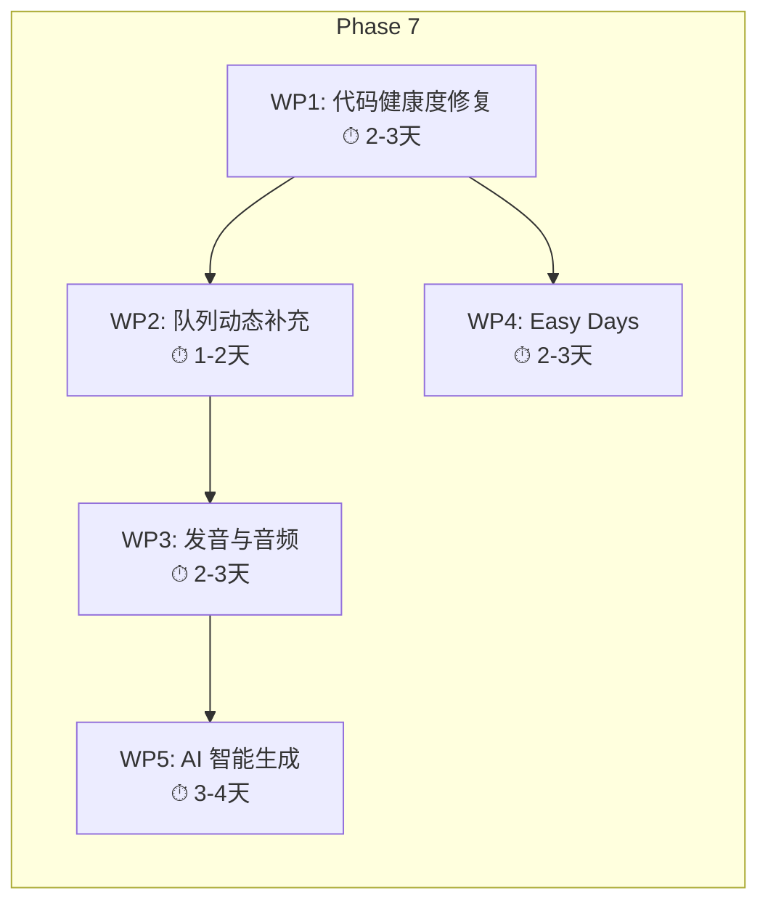
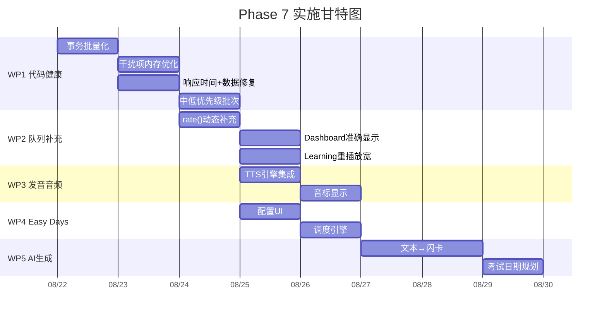

# Reciter Phase 7 调查报告

> **调查范围**：代码深度审计 · 竞品功能对标 · Phase 7 实施规划  
> **生成日期**：2026-08-21  
> **调查方法**：3 个并行 Agent（代码审计 / 竞品调研 / 文档分析）协同工作

---

## 第一部分：代码深度审计 — 17 个潜在问题

### 🔴 Critical（2 个）

#### C-1. 备份恢复无事务包裹，大量数据恢复极慢

| 项 | 值 |
|---|---|
| 文件 | [backup.ts](file:///F:/AI/Reciter/src/lib/backup.ts#L112-L114) |
| 类别 | 性能 / 数据库 |
| 影响 | 恢复数千张卡片时每张独立 IPC + SQLite 自动提交，导致分钟级 UI 冻结 |

**修复**：将 `restoreDeck` / `restoreCard` 的循环包裹在单个数据库事务中（`BEGIN TRANSACTION` → 批量 INSERT → `COMMIT`）。

#### C-2. 导入流程逐卡片串行 SQL，批量导入极慢

| 项 | 值 |
|---|---|
| 文件 | [Import.tsx](file:///F:/AI/Reciter/src/pages/Import.tsx#L177-L191) |
| 类别 | 性能 / 数据库 |
| 影响 | 大型 Markdown/CSV 文件导入时数千条未批处理的同步 SQL 查询导致 UI 冻结 |

**修复**：将 `createDeck` 提取到循环外（缓存 deckId），所有 `upsertCard` 操作放入单个事务批量执行。

---

### 🟠 High（4 个）

#### H-1. 干扰项加载全词库到内存

| 项 | 值 |
|---|---|
| 文件 | [Study.tsx](file:///F:/AI/Reciter/src/pages/Study.tsx#L234-L243) |
| 类别 | 性能 / 内存 |
| 影响 | `db.getCardsByDeck(deckId)` 将整个词库（可能数万张）全部载入 React 状态，仅用于提取 front/back 字符串 |

**修复**：在 SQLite 层新增 `getRandomDistractors(deckId, limit)` 方法，使用 `ORDER BY RANDOM() LIMIT 50` 直接从数据库随机取样。

#### H-2. 形近词算法 O(M×N) 主线程阻塞

| 项 | 值 |
|---|---|
| 文件 | [StudyCard.tsx](file:///F:/AI/Reciter/src/components/study/StudyCard.tsx#L440-L466) |
| 类别 | 性能 |
| 影响 | `pickSimilarWords` 在渲染期间同步计算全量干扰项的 Levenshtein 距离，大词库时每张卡片切换都卡顿 |

**修复**：限制候选数组最大 50-100 项再传入；或将计算下移到 Web Worker。

#### H-3. 响应时间未封顶污染 FSRS 优化数据

| 项 | 值 |
|---|---|
| 文件 | [review.ts](file:///F:/AI/Reciter/src/lib/review.ts#L53) |
| 类别 | 数据完整性 |
| 影响 | 用户挂机/切后台时 `responseTimeMs` 可达数小时，永久污染 FSRS 算法的优化数据 |

**修复**：在写入 `review_logs` 前将 `responseTimeMs` 限制在合理上限（如 60,000ms）。

#### H-4. 主动回忆模式仅支持中文释义匹配

| 项 | 值 |
|---|---|
| 文件 | [recall-match.ts](file:///F:/AI/Reciter/src/lib/recall-match.ts#L22) |
| 类别 | 逻辑 Bug |
| 影响 | `splitMeanings` 过滤掉无中文字符的片段，英英/西英等非中文释义词库的主动回忆模式永远 0 分 |

**修复**：移除 CJK 正则检查，改用通用过滤器排除常见语法标签（如 `n.` `v.` `adj.`）。

---

### 🟡 Medium（7 个）

| # | 文件 | 问题 | 修复方向 |
|---|---|---|---|
| M-1 | [db.ts#L221-L255](file:///F:/AI/Reciter/src/lib/db.ts#L221-L255) | 标签查询全量 `JSON.parse` 循环 | 改用 SQLite `json_each()` 原生函数 |
| M-2 | [Dashboard.tsx#L39-L42](file:///F:/AI/Reciter/src/pages/Dashboard.tsx#L39-L42) | Dashboard N+1 查询（逐词库查 due 数） | 改为调用已有的 `getDeckDueCounts()` 单次查询 |
| M-3 | [useStudyStore.ts#L204-L220](file:///F:/AI/Reciter/src/stores/useStudyStore.ts#L204-L220) | 去重追踪用 `Array.includes()` O(N²) | 改用 `Set<number>` 实现 O(1) 查找 |
| M-4 | [db.ts#L72-L76](file:///F:/AI/Reciter/src/lib/db.ts#L72-L76) | 标签过滤用 LIKE 模糊匹配不可靠 | 改用 `json_each(c.tags)` 精确匹配 |
| M-5 | [day.ts#L22](file:///F:/AI/Reciter/src/lib/day.ts#L22) | `setDate(d-1)` 在 DST 切换时错位 | 改用 `d.setTime(d.getTime() - 86400000)` |
| M-6 | [useStudyStore.ts#L35](file:///F:/AI/Reciter/src/stores/useStudyStore.ts#L35) | `push(...arr)` 超大数组溢出栈 | 改用 `result.concat()` |
| M-7 | [useStudyStore.ts#L59](file:///F:/AI/Reciter/src/stores/useStudyStore.ts#L59) | `insertByOffset` 直接 splice 突变数组 | 在 `rate()` 中已做 `[...queue]` 浅拷贝，但建议改为不可变操作以防未来遗漏 |

---

### 🔵 Low（4 个）

| # | 文件 | 问题 |
|---|---|---|
| L-1 | [StudyCard.tsx#L485](file:///F:/AI/Reciter/src/components/study/StudyCard.tsx#L485) | 自动评分 setTimeout 未在手动评分时清除，可能双重评分 |
| L-2 | [study-prefs.ts#L104-L111](file:///F:/AI/Reciter/src/lib/study-prefs.ts#L104-L111) | 删除词库时关联的 `deck_shuffle_${id}` 设置成为孤儿数据 |
| L-3 | [fsrs.ts#L29-L37](file:///F:/AI/Reciter/src/lib/fsrs.ts#L29-L37) | 无效学习步骤输入静默回退默认值，无用户反馈 |
| L-4 | [DeckDetail.tsx#L132-L136](file:///F:/AI/Reciter/src/pages/DeckDetail.tsx#L132-L136) | 大词库搜索过滤未做防抖/useMemo |

---

## 第二部分：竞品功能对标

### 六款竞品功能矩阵

| 功能维度 | 不背单词 | Knowt | Anki | Quizlet | 墨墨背单词 | 百词斩 | **Reciter** |
|---|---|---|---|---|---|---|---|
| **核心算法** | 艾宾浩斯4遍通过 | SRS+考试日期定向 | FSRS / SM-2 | 自适应SRS | 专有MM算法 | 固定间隔(1/2/4/7/15天) | ✅ FSRS-5 |
| **语境学习** | ⭐ 150万真实影音例句 | AI生成语境 | 插件 | 基础 | 用户助记 | 图片联想 | ✅ Markdown语境 |
| **AI 生成卡片** | ❌ | ⭐ PDF/视频→闪卡 | 插件 | Magic Notes | ❌ | ❌ | ❌ **缺失** |
| **AI 对话练习** | ❌ | ❌ | ❌ | Q-Chat苏格拉底式 | ❌ | ❌ | ✅ AI多轮对话 |
| **发音/音频** | ⭐ 核心特色 | ✅ | 插件 | ✅ | ✅ | ✅ | ❌ **缺失** |
| **游戏化** | 极简 | 练习测试 | 第三方插件 | ⭐ Match/Live | 极简 | ⭐ PK/排行榜 | ❌ **缺失** |
| **社区/分享** | 有限 | 公共卡组 | AnkiWeb共享 | ⭐ 海量社区 | 用户助记 | 好友PK | ❌ **缺失** |
| **多端同步** | ✅ 云同步 | ✅ 云同步 | ✅ AnkiWeb | ✅ 云同步 | ✅ 云同步 | ✅ 云同步 | ⚠️ 仅JSON手动迁移 |
| **统计可视化** | 基础 | 基础 | ⭐ 深度分析 | 基础 | ⭐ 详细遗忘曲线 | 基础打卡 | ✅ 趋势图+热力图 |
| **考试日期规划** | 考试词书 | ⭐ 核心特色 | ❌ | ❌ | 考试词书 | 考试词书 | ❌ **缺失** |
| **Easy Days** | ❌ | ❌ | ⭐ 2025新增 | ❌ | ❌ | ❌ | ❌ **缺失** |
| **内容自由度** | 固定词书 | 高（AI辅助） | ⭐ 极高 | 中等 | 固定词书 | 固定词书 | ✅ Markdown自由导入 |
| **开源** | ❌ | ❌ | ✅ | ❌ | ❌ | ❌ | ✅ |

### 行业趋势（2024-2026）

1. **AI 生成内容**：从手动制卡转向 AI 从 PDF/视频/笔记自动生成闪卡
2. **语境沉浸**：孤立单词记忆过时，真实影音语境/AI 生成例句成为标配
3. **对话式 AI 练习**：LLM 充当 24/7 苏格拉底式导师
4. **数据驱动个性化算法**：从固定间隔到 FSRS 等神经网络模型，降低 20-30% 复习量
5. **有意义的游戏化**：从简单打卡/连续天数到需要主动语言产出的"语言赌注"

### Reciter 的差异化优势与差距

**现有优势**：
- ✅ FSRS-5 算法（与 Anki 同级，领先国内竞品）
- ✅ Markdown 自由导入（内容自由度接近 Anki）
- ✅ AI 多轮对话练习（领先多数竞品）
- ✅ 认知科学审计驱动的学习流（交错、主动回忆、形近词干扰）
- ✅ 本地优先 + 开源

**关键差距**：
- ❌ 无发音/音频（不背单词的核心竞争力）
- ❌ 无 AI 自动生成卡片（Knowt 的核心竞争力）
- ❌ 无 Easy Days 负载均衡（Anki 2025 新增）
- ❌ 无考试日期规划（Knowt 核心特色）
- ❌ 多端同步仅靠手动 JSON（竞品全部云同步）

---

## 第三部分：Phase 7 规划方案 — 5 大工作包 × 16 个任务

### 工作包总览



---

### WP1：代码健康度修复（优先级最高）

> 修复审计发现的 Critical/High 问题，为后续功能开发打下稳定基础。

#### 任务 1.1：数据库事务批量化

**Agent 工作流程**：

```
步骤 1: 阅读 src/lib/sql/backend.ts 接口定义
        → 确认 SQLBackend 是否已有 execute('BEGIN') 能力
        → 若无，为 SQLBackend 接口新增 transaction(fn) 方法

步骤 2: 修改 src/lib/backup.ts
        → importFromJSON() 中的 restoreDeck/restoreCard 循环
        → 包裹在 BEGIN TRANSACTION ... COMMIT 中
        → 错误时 ROLLBACK

步骤 3: 修改 src/lib/importer.ts（若存在批量导入逻辑）
        → 同样事务化

步骤 4: 修改 Import.tsx
        → createDeck 提到循环外（缓存 deckId）
        → upsertCard 批量执行

步骤 5: 验证
        → 准备 1000+ 卡片的测试 Markdown 文件
        → 对比修改前后导入耗时
        → npm run build 通过
```

**涉及文件**：
- `src/lib/sql/backend.ts` — 接口扩展
- `src/lib/sql/tauri-backend.ts` — Tauri 实现
- `src/lib/sql/sqljs-backend.ts` — Web 实现
- `src/lib/backup.ts` — 恢复逻辑
- `src/pages/Import.tsx` — 导入页面

#### 任务 1.2：干扰项内存优化

**Agent 工作流程**：

```
步骤 1: 在 src/lib/db.ts 新增方法
        → getRandomDistractors(deckId: number, excludeCardId: number, limit = 50)
        → SQL: SELECT front, back FROM cards
               WHERE deck_id = ? AND id != ?
               ORDER BY RANDOM() LIMIT ?

步骤 2: 修改 src/pages/Study.tsx
        → 将 db.getCardsByDeck(deckId) 替换为 db.getRandomDistractors()
        → 每次切换卡片时可选择性刷新一批新干扰项

步骤 3: 修改 StudyCard.tsx 的 pickSimilarWords 调用
        → 确保传入的 distractors 数量已受限
        → 移除不必要的全量计算

步骤 4: 验证
        → 用 5000+ 卡片词库测试
        → Chrome DevTools Memory 面板对比修改前后堆占用
        → 确认选择题干扰项质量不降
```

**涉及文件**：
- `src/lib/db.ts` — 新增查询方法
- `src/pages/Study.tsx` — 替换加载逻辑
- `src/components/study/StudyCard.tsx` — 调整调用

#### 任务 1.3：响应时间封顶 + 其他数据修复

**Agent 工作流程**：

```
步骤 1: 修改 src/lib/review.ts
        → applyReview() 中在写入前:
          const cappedTime = Math.min(responseTimeMs, 60_000);

步骤 2: 修改 src/lib/recall-match.ts
        → splitMeanings() 移除 CJK-only 过滤
        → 改为过滤长度 < 2 的碎片 + 常见语法标签

步骤 3: 修改 src/stores/useStudyStore.ts
        → stats 中的 reviewedCardIds/againCardIds/hardCardIds
        → 改为 Set<number> 类型

步骤 4: 修改 src/pages/Dashboard.tsx
        → 将 N+1 循环查询替换为单次 getDeckDueCounts()

步骤 5: npm run build 验证通过
```

**涉及文件**：
- `src/lib/review.ts`
- `src/lib/recall-match.ts`
- `src/stores/useStudyStore.ts`
- `src/pages/Dashboard.tsx`

#### 任务 1.4：中低优先级修复批次

**Agent 工作流程**：

```
步骤 1: src/lib/db.ts — 标签查询改用 json_each()
        → getDeckTags / getDeckTagsWithCount / tagWhere+tagParam
        → SELECT DISTINCT value FROM json_each(c.tags) ...

步骤 2: src/lib/day.ts — DST 安全修复
        → getDayStartDate: setDate(d-1) → setTime(t - 86400000)

步骤 3: src/stores/useStudyStore.ts — concat 替代 push spread
        → interleaveQueue 中的 result.push(...shuffleRows(rest))
        → 改为 result = result.concat(shuffleRows(rest))

步骤 4: src/components/study/StudyCard.tsx — 清除自动评分定时器
        → 在 submitChoice/submitFill 中 clearTimeout(timerRef.current)

步骤 5: src/lib/study-prefs.ts + src/lib/db.ts — 词库删除清理孤儿设置
        → deleteDeck 时级联删除 deck_shuffle_${id} 等 key

步骤 6: src/pages/DeckDetail.tsx — 搜索防抖
        → 用 useDeferredValue 或 debounce 包裹搜索过滤

步骤 7: npm run build + 回归测试
```

---

### WP2：学习队列动态补充（解决之前分析的核心问题）

#### 任务 2.1：rate() 中自动补充到期卡片

**Agent 工作流程**：

```
步骤 1: 阅读 src/stores/useStudyStore.ts 的 rate() 方法

步骤 2: 在 rate() 评分完成后、设置 finished 前，添加补充逻辑:

        const remaining = queueNext.length - nextIndex;
        const REFILL_THRESHOLD = 3;

        if (remaining <= REFILL_THRESHOLD && deckId !== null) {
          // 收集当前队列中所有未消费卡片的 ID
          const existingIds = new Set(
            queueNext.slice(nextIndex).map(q => q.row.card_id)
          );
          // 查询此刻新到期的卡片
          const moreDue = await db.getDueCards(
            deckId, new Date().toISOString(),
            get().tagName || undefined,
            get().keyOnly,
            20
          );
          // 过滤已在队列中的
          const freshCards = moreDue.filter(r => !existingIds.has(r.card_id));
          if (freshCards.length > 0) {
            queueNext.push(
              ...freshCards.map(row => ({ row, shownAt: Date.now() }))
            );
          }
        }

步骤 3: 更新 finished 判断逻辑
        → 只有补充后仍无卡片才标记 finished

步骤 4: 验证
        → 模拟：加载 10 张队列 → 全部评 Good → 等 1 分钟
        → 确认 Learning 步骤到期的卡片被自动补充进来
        → 确认 finished 状态在真正无卡时才触发
```

#### 任务 2.2：Dashboard 显示准确可复习数

**Agent 工作流程**：

```
步骤 1: 修改 src/pages/Dashboard.tsx
        → 统计数字分为两个指标:
          - "当前可复习": getDueCountByDeck(id, now.toISOString())
                        + Math.min(result, reviewLimit - todayReviewed)
          - "今日预计总量": 保留现有 dayEnd 计算（可选，灰色显示）

步骤 2: 在 STATS 数组中更新 label 与 hint
        → { label: "当前可复习", value: actualDue, hint: "此刻已到期且在配额内" }

步骤 3: 验证
        → 打开 Dashboard 确认数字 ≈ 进入学习后 queue.length
        → 数字不再有大幅偏差
```

#### 任务 2.3：放宽 Learning 卡重插限制

**Agent 工作流程**：

```
步骤 1: 修改 src/stores/useStudyStore.ts 的 rate() 中 reinsert 判断:

        // 修改前
        const reinsert = grade === Rating.Again
          || (newFsrs.state === State.Learning && !item.tested);

        // 修改后：Learning/Relearning 始终重插
        const reinsert = grade === Rating.Again
          || newFsrs.state === State.Learning
          || newFsrs.state === State.Relearning;

步骤 2: 但需防止同一张卡在队列中出现多份
        → 在 insertByOffset 前检查队列后半段是否已有该 card_id
        → 若已有则跳过（不重复插入）

步骤 3: 移除或弱化 tested 标记
        → tested 仅用于新卡首次教学后的"延迟突击测试"逻辑
        → 不再影响 Learning 卡的正常重插

步骤 4: 验证
        → 新卡学习流程：New → 教学 → 1分钟后测试 → 10分钟后再测试
        → 确认 FSRS 的 learning_steps (1m, 10m) 被完整执行
        → 确认不会出现"队尾同一张卡反复"的老问题
```

---

### WP3：发音与音频系统（填补核心竞品差距）

#### 任务 3.1：TTS 发音引擎集成

**Agent 工作流程**：

```
步骤 1: 技术选型
        → 优先 Web Speech API (speechSynthesis) — 零依赖、离线可用
        → 备选 Tauri 端调用系统 TTS 命令 (Windows SAPI)
        → 高级选项：有道/Google TTS API（需网络）

步骤 2: 新建 src/lib/tts.ts
        → export function speak(word: string, lang = 'en-US'): void
        → 使用 window.speechSynthesis.speak()
        → 支持语速/音量配置（从 settings 读取）
        → 错误处理：无 TTS 引擎时静默降级

步骤 3: 修改 StudyCard.tsx
        → 在单词展示区域添加🔊发音按钮
        → 翻转卡片时自动朗读（可配置开关）
        → 主动回忆模式：答对后自动朗读正确答案

步骤 4: 设置页面增加 TTS 配置
        → 自动朗读开关、语速、语音选择

步骤 5: 验证
        → Windows + Chrome 双平台测试
        → 确认离线也能使用系统 TTS
```

**涉及文件**：
- `src/lib/tts.ts` — 新建
- `src/components/study/StudyCard.tsx` — 添加发音按钮
- `src/pages/Settings.tsx` — TTS 配置项

#### 任务 3.2：音标显示

**Agent 工作流程**：

```
步骤 1: 数据源选择
        → 方案 A: 使用开源音标数据库 (如 CMU Pronouncing Dictionary)
        → 方案 B: 在 Markdown 导入时支持音标标注语法 (如 /prəˈnaʊns/)
        → 方案 C: 调用免费词典 API 获取音标 (如 Free Dictionary API)

步骤 2: 数据库扩展
        → 新增迁移: ALTER TABLE cards ADD COLUMN phonetic TEXT DEFAULT ''
        → 更新 StudyCardRow 类型

步骤 3: 导入增强
        → markdown-parser.ts 支持解析音标语法
        → 或在卡片详情中支持手动编辑音标

步骤 4: UI 展示
        → StudyCard 的 front 下方显示音标
        → 点击音标触发 TTS 朗读

步骤 5: 验证 → npm run build + 导入测试
```

---

### WP4：Easy Days 负载均衡

#### 任务 4.1：Easy Days 配置 UI

**Agent 工作流程**：

```
步骤 1: 设计数据模型
        → settings 表存储: easy_days_config = JSON
          {
            "enabled": true,
            "weekdays": { "0": 0.5, "6": 0.5 },  // 周日/周六减半
            "specificDates": ["2026-09-01"]         // 特定日期禁复习
          }

步骤 2: 新建 src/lib/easy-days.ts
        → export function getEasyDaysFactor(date: Date): number
        → 返回 0~1 的系数（0=不复习, 0.5=减半, 1=正常）

步骤 3: 修改 Settings.tsx
        → 新增 "Easy Days" 配置卡片
        → 周一~周日的复习系数滑块 (0%/50%/100%)
        → 特定日期选择器（如考试前一天设为 0%）

步骤 4: 验证
        → 确认配置能正确存入/读取 settings 表
        → UI 交互流畅
```

#### 任务 4.2：Easy Days 调度引擎

**Agent 工作流程**：

```
步骤 1: 修改 src/stores/useStudyStore.ts 的 loadQueue()
        → 读取 Easy Days 配置
        → 按当日系数缩减 reviewLimit:
          const factor = getEasyDaysFactor(now);
          const adjustedLimit = Math.round(reviewLimit * factor);
          const dueLimit = Math.max(0, adjustedLimit - todayReviewed);

步骤 2: 修改 Dashboard 的待复习数显示
        → 同样应用 Easy Days 系数
        → 显示提示: "今日为轻松日，复习量已减至 50%"

步骤 3: FSRS 调度增强（高级）
        → 修改 fsrs.ts 的 reviewCard，传入 Easy Days 参数
        → 让 ts-fsrs 在安排下次 due 时避开 Easy Days
        → 参考 ts-fsrs 文档中 enable_short_term 和 next_dates 参数

步骤 4: 验证
        → 设置周末为 50%
        → 确认周末时队列长度约为平时的一半
        → 确认平摊的卡片正确分配到邻近日期
```

---

### WP5：AI 智能生成卡片（对标 Knowt 核心功能）

#### 任务 5.1：文本 → 闪卡自动生成

**Agent 工作流程**：

```
步骤 1: 新建 src/lib/ai-generate.ts
        → 定义 Prompt 模板：
          "从以下文本中提取英语单词/短语，为每个生成：
           1. 单词/短语 (front)
           2. 中文释义 (back)
           3. 一个例句
           输出 JSON 数组格式: [{ front, back, example }]"

步骤 2: 复用现有 AI 架构
        → 使用 src/lib/ai-client.ts 的 sendMessage()
        → 使用 src/lib/ai-parse.ts 解析 JSON 响应
        → 处理 AI 返回格式异常的降级

步骤 3: 新建 UI 组件 src/components/ai/AIGeneratePanel.tsx
        → 文本输入区（粘贴笔记/文章）
        → "生成闪卡" 按钮 → 加载状态
        → 预览生成结果表格（可勾选/编辑/删除）
        → "导入到词库" 按钮

步骤 4: 在 Import.tsx 中添加入口
        → 新增 "AI 智能生成" 标签页
        → 或在导入方式选择中增加 "从文本 AI 提取"

步骤 5: 验证
        → 粘贴一段英文文章
        → 确认 AI 能正确提取单词并生成释义
        → 确认预览编辑后能成功导入词库
```

**涉及文件**：
- `src/lib/ai-generate.ts` — 新建
- `src/components/ai/AIGeneratePanel.tsx` — 新建
- `src/pages/Import.tsx` — 添加入口

#### 任务 5.2：考试日期规划

**Agent 工作流程**：

```
步骤 1: 数据模型
        → settings 表: exam_date = "2026-12-20"
        → settings 表: exam_deck_ids = "[1, 3]" (关联词库)

步骤 2: 新建 src/lib/exam-planner.ts
        → 根据考试日期与词库总量计算每日学习计划:
          const daysUntilExam = diffDays(examDate, today);
          const unlearned = await db.getGlobalNewCount();
          const dailyNewTarget = Math.ceil(unlearned / daysUntilExam);
        → 动态调整 new_cards_per_day 建议值

步骤 3: UI: Settings 或 Dashboard 添加考试倒计时组件
        → 设置考试日期
        → 显示倒计时 + 每日建议新卡数
        → 进度条：已学/总量 vs 剩余天数

步骤 4: loadQueue 中可选应用考试规划的 new_cards_per_day
        → 覆盖词库默认值

步骤 5: 验证
        → 设定 30 天后考试，2000 词词库
        → 确认每日新卡 ≈ 67 张
        → 确认 Dashboard 显示正确的倒计时与进度
```

---

## 实施优先级与时间线



| 工作包 | 优先级 | 预计工时 | 价值 |
|---|---|---|---|
| **WP1: 代码健康度** | ⭐⭐⭐ | 2-3 天 | 消除性能瓶颈和数据风险，为后续开发打基础 |
| **WP2: 队列动态补充** | ⭐⭐⭐ | 1-2 天 | 直接解决用户当前体验到的核心问题 |
| **WP3: 发音音频** | ⭐⭐ | 2-3 天 | 填补与不背单词的最大功能差距 |
| **WP4: Easy Days** | ⭐⭐ | 2-3 天 | 对标 Anki 2025，差异化调度能力 |
| **WP5: AI 智能生成** | ⭐ | 3-4 天 | 对标 Knowt，提升内容创建效率 |

> [!TIP]
> 建议执行顺序：**WP1 → WP2 → WP3/WP4（可并行）→ WP5**。WP1+WP2 合计 3-5 天即可显著提升现有体验，WP3-WP5 为竞品追赶方向。
