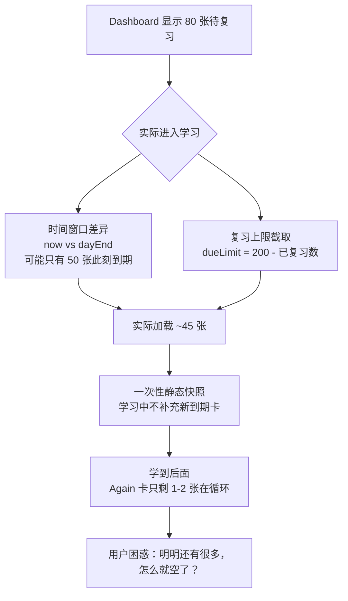

# 学习队列"余量显示多但实际队列稀疏"问题分析

## 问题现象

Dashboard 显示"今日待复习"数量还有很多（比如 80 张），但进入学习后，学到后面几轮，队列里只剩 1-2 张卡片不断循环。

---

## 根因分析

核心矛盾在于：**Dashboard 显示的是数据库中"全部到期卡片数"，而实际学习队列在加载时受了复习上限的截取，且是一次性静态快照，不会动态补充。**

### 差异一：Dashboard 计数 vs 实际队列加载的时间窗口不同

| 对比项 | Dashboard 显示 | loadQueue 实际加载 |
|---|---|---|
| 查询函数 | [`getDueCountByDeck()`](file:///F:/AI/Reciter/src/lib/db.ts#L605-L614) | [`getDueCards()`](file:///F:/AI/Reciter/src/lib/db.ts#L500-L516) |
| 时间参数 | `dayEnd`（今日学习日终点，约明天 04:00） | `now`（当前时刻） |
| 条件 | `cs.due < dayEnd`（宽松：含今天所有到期的） | `cs.due <= now`（严格：只取此刻已到期的） |

> [!IMPORTANT]
> Dashboard 用 `dayEnd`（≈明天凌晨 4:00）作为截止时间，统计了**整天会到期的所有卡片**。
> 但 `loadQueue` 用 `now`（当前时刻）加载，只取**此刻已经到期的**卡片。
>
> 那些安排在"今天下午/晚上"到期的卡片在 Dashboard 被计入待复习，但进入学习时还没到期、不会出现在队列中。

这个差异本身是合理的设计（不该提前复习还没到时间的卡片），但**导致用户感知与实际不符**。

### 差异二：复习上限截取

```typescript
// useStudyStore.ts L135-139
const reviewLimit = reviewLimitRaw ? parseInt(reviewLimitRaw, 10) : 200;
const todayReviewed = await db.countReviewsToday(dayStart.toISOString());
const dueLimit = Math.max(0, reviewLimit - todayReviewed);
const due = dueLimit > 0 ? await db.getDueCards(deckId, now.toISOString(), tag, keyOnly, dueLimit) : [];
```

- 复习上限默认 200，减去今天已复习数后得到 `dueLimit`
- Dashboard 的待复习数**没有考虑复习上限的截取**
- 如果用户已经复习了很多，`dueLimit` 会很小，实际加载的卡片就很少

### 差异三（主因）：队列是一次性快照，不会动态补充

> [!CAUTION]
> **这是最关键的问题。** `loadQueue` 只在进入学习时执行一次，构建一个静态队列。学习过程中：
> - 评分 Good/Easy 的卡片直接从队列中"消费"掉（index 前进）
> - 评分 Again 或处于 Learning 的卡片会重插队列
> - **但没有任何机制从数据库重新拉取"在学习过程中新到期的卡片"**
>
> 这意味着：如果 FSRS 给一张 Learning 卡安排的 due 是 10 分钟后，这张卡在 `loadQueue` 时还未到期所以不在队列中。10 分钟后它到期了，但不会被追加进队列。

学习后期的场景：

```
初始队列（60张）: [卡1, 卡2, ..., 卡60]
                           ↑ index 一路前进

学到第 55 张时：
  - 只剩 5 张未看的卡片
  - 期间有一些 Again 的卡被重插
  - 但新到期的卡（之前 Learning 步骤安排在几分钟后的）
    完全没有被加进来

最终队列末尾：
  [...已消费的50张..., 卡51(重插的Again), 卡52, ..., 卡55, 重插的Again卡56]
                                                                ↑ 只剩1-2张
```

### 差异四：重插逻辑的 `tested` 标记限制

```typescript
// useStudyStore.ts L225-226
const reinsert =
  grade === Rating.Again || (newFsrs.state === State.Learning && !item.tested);
```

新卡首次教学后重插队列时被标记 `tested: true`。之后即使 FSRS 仍判定为 Learning 状态，也**不再重插**。这是为了"避免队尾反复出现"，但副作用是 Learning 步骤被截断——本应多次复习的新卡只能被复习一次就被放走了。

---

## 总结：四个因素叠加



---

## 修改建议

### 建议 1（推荐）：队列中途自动补充到期卡片

在 `rate()` 方法中，每消费 N 张卡或队列剩余不足时，从数据库重新查询新到期的卡片并追加到队列：

```typescript
// 在 rate() 方法中，评分后检查是否需要补充
const remaining = queueNext.length - nextIndex;
if (remaining <= 3) {
  // 查询此刻新到期但不在当前队列中的卡片
  const existingIds = new Set(queueNext.slice(nextIndex).map(q => q.row.card_id));
  const moreDue = await db.getDueCards(deckId, new Date().toISOString(), tagName, keyOnly, 20);
  const fresh = moreDue.filter(r => !existingIds.has(r.card_id));
  if (fresh.length > 0) {
    queueNext.push(...fresh.map(row => ({ row, shownAt: Date.now() })));
  }
}
```

### 建议 2（推荐）：Dashboard 显示更准确的数量

将 Dashboard 的待复习数改为与 `loadQueue` 一致的时间窗口（`now` 而非 `dayEnd`），并扣除复习上限：

```typescript
// Dashboard.tsx
// 改为: db.getDueCountByDeck(d.id, new Date().toISOString())
// 并显示: Math.min(dueCount, reviewLimit - todayReviewed)
```

或者保留 `dayEnd` 但分两行显示：
- **当前可复习**：此刻已到期且在配额内的数量
- **今日预计总量**：包含稍后到期的（原来的数量）

### 建议 3：放宽 Learning 卡的 `tested` 限制

当前 `tested` 标记让新卡只能被重插一次。建议改为：**只有当 FSRS 判定卡片进入 Review 状态时才停止重插**，Learning 阶段应持续重插直到步骤完成：

```typescript
// 修改前
const reinsert = grade === Rating.Again || (newFsrs.state === State.Learning && !item.tested);

// 修改后：Learning/Relearning 状态始终重插（FSRS 步骤未完成）
// Again 评分也始终重插
const reinsert = grade === Rating.Again
  || newFsrs.state === State.Learning
  || newFsrs.state === State.Relearning;
```

这样做需要配合在 `insertByOffset` 中做好去重（同一张卡不要在队列中出现多份），避免"队尾反复出现"的老问题。

### 建议 4（可选）：`loadQueue` 使用 `dayEnd` 预加载

将 `loadQueue` 中的 `getDueCards` 时间参数从 `now` 改为 `dayEnd`，一次性加载今天所有会到期的卡片。对于 due 还在未来的卡片，在到达时按 `insertByOffset` 的偏移逻辑排在后面即可。这样队列一开始就包含了所有卡片，不会越学越空。

---

## 实施优先级

| 优先级 | 建议 | 效果 | 复杂度 |
|---|---|---|---|
| ⭐ P0 | 建议 1：中途补充 | 直接解决"队列越学越空"的核心问题 | 中等 |
| ⭐ P0 | 建议 2：Dashboard 显示准确 | 消除用户困惑 | 简单 |
| P1 | 建议 3：Learning 重插 | 让新卡教学步骤完整 | 简单但需测试 |
| P2 | 建议 4：预加载 dayEnd | 更好的替代方案（与建议1二选一） | 中等 |

> [!TIP]
> **建议 1 + 建议 2 组合实施**可以彻底解决问题。建议 4 是建议 1 的替代方案，两者选其一即可。
